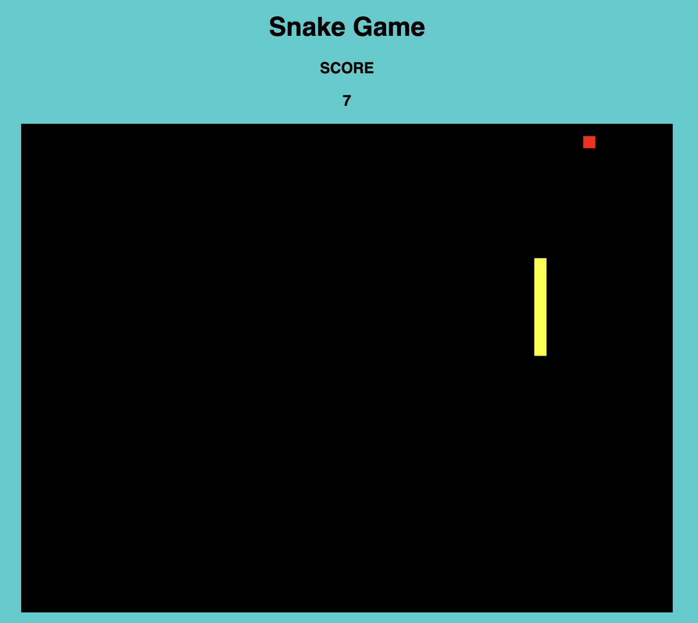

# Snake-Game-app
This is a Snake Game app written in Javascript, HTML, and CSS.

<strong>Click <a href="https://mauroleos.github.io/Snake-Game-app/"><b>here</b></a> to see website.</strong>

# Summary
  This application is personal to me due to the fact that it not only is the first game that I develop by myself, but it also sparked my curiosity for game development. This is a classic Snake Game I built using JavaScript, HTML5, Canvas, and CSS3. This project put my problem solving skills to the test forcing me to apply everything I've learned from simple for loops and functions, to pixel manipulation, setInterval, and Canvas methods. 

  The toughest part of getting this game to function properly was the snake movement. I learned to really take my time writing clean and coherent pseudocode in order to really understand what steps to take in order reach my destination without feeling overwhelmed. I also learned the importance of understanding how debugging works and how to setup the perfect debugging environment. By doing so, I was able to save myself plenty of time by speeding up the trial and error testing process. By taking my time to understand what I wanted the snake to do and writting good pseudocode, this made eveything come together splendidly at the end.
  
# Author
<strong>Mauro Leos</strong> - <i>Full-Stack Software Developer</i> - <a href="https://www.linkedin.com/in/mauro-leos-b4103a11b/">LinkedIn </a> - <a href="https://www.mauroleos.com//">Website</a>
